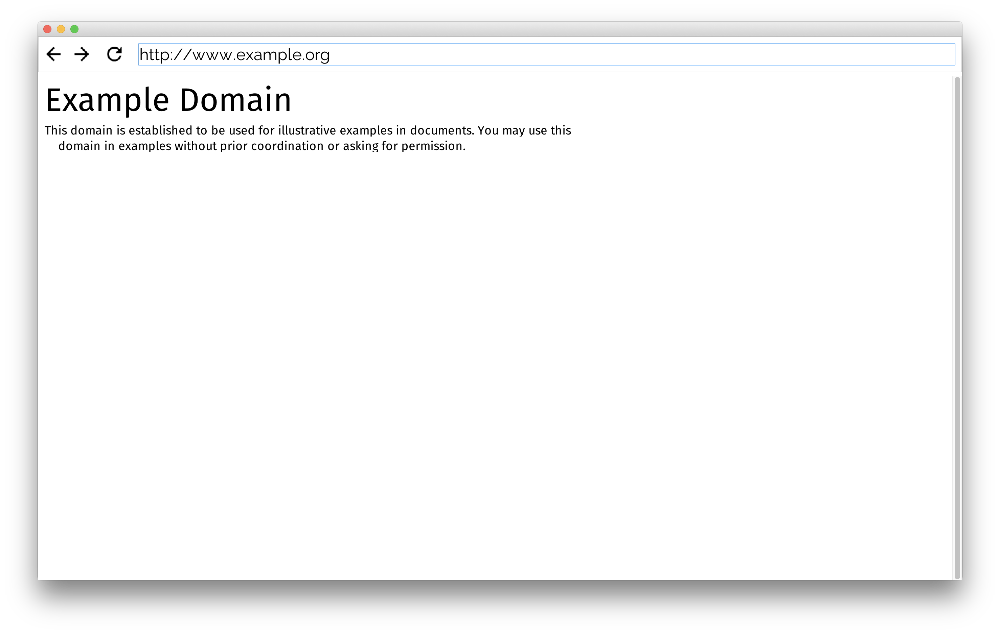

# Mini-Browser
This is a mini browser that fetches the contents of the given website, parses it and performs the respective operations.
This browser is in its initial stage.
Until now it only understands 3 types of tags
  * Heading tag("h1")
  * Paragraph tag("p")
  * Divison tag("div")

### Example : 

